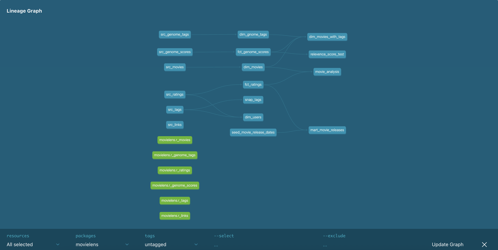
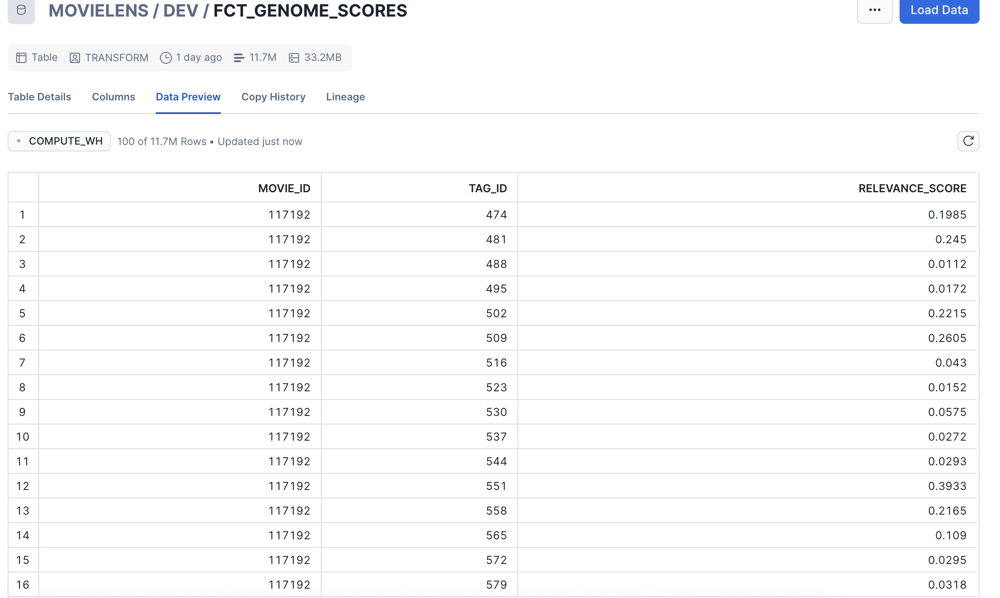
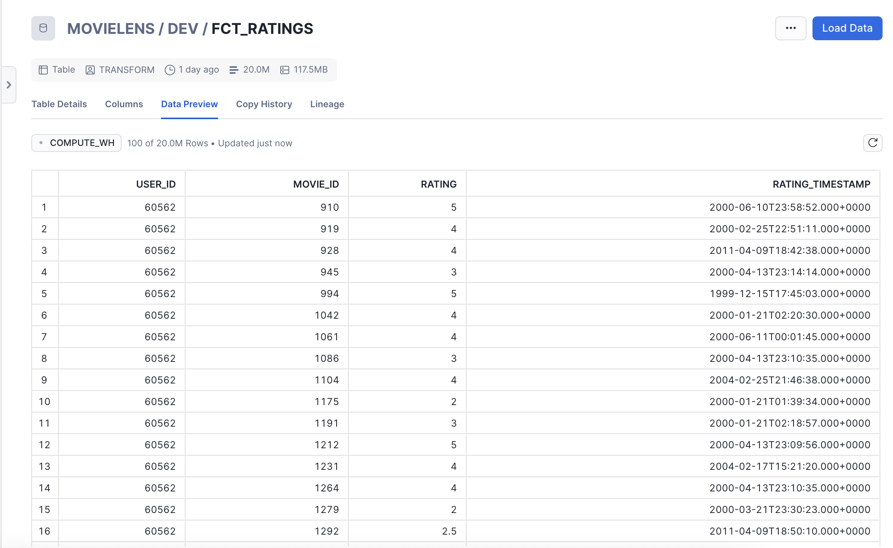
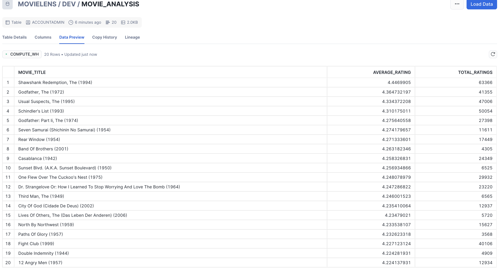

# MovieLens DBT Project

This project demonstrates an end-to-end data transformation workflow using **MovieLens dataset**, **dbt**, **Snowflake**, and **Amazon S3**.

---

## Project Overview

- **Source Data:** MovieLens dataset stored in Amazon S3.
- **Data Warehouse:** Snowflake.
- **dbt Project Structure:**
  - `raw/` schema: Raw tables loaded from S3.
  - `dev/` schema: Main development environment.
    - `models/`
      - `staging/`: Landing views for raw data.
      - `dim/`: Dimension tables for basic data transformations.
        - `dim_gnome_tags.sql`
        - `dim_movies.sql`
        - `dim_movies_with_tags.sql`
        - `dim_users.sql`
      - `fct/`: Fact tables with transformations.
        - `fct_genome_scores.sql`
        - `fct_ratings.sql`
      - `schema.yml`: Defines models and adds tests.
      - `sources.yml`: Defines raw data sources.
- **Snapshots:** `src_tags` table snapshot to track historical changes.
- **Macros:** Custom macro for testing `fct_genome_scores` table.
- **Analysis:** Identify the top 20 movies with more than 100 ratings.


## Snowflake Setup

Follow the snowflake_instructions.sql inside the project to prepare the Snowflake environment.


---

## Screenshots

### dbt Lineage Graph


### Fact Tables in Snowflake



### Final Table: Top 20 Movies by Rating


---

## How to Run the Project

1. Clone this repository:
```bash
git clone https://github.com/<your-username>/dbt-movielens.git
cd dbt-movielens
 ```

2. Set up a dbt virtual environment and install dependencies:
python -m venv dbt_env
source dbt_env/bin/activate
pip install dbt-snowflake

3. Create a profiles.yml with your Snowflake credentials

4. Run dbt commands:
dbt deps          # Install packages
dbt seed          # If you have seed files
dbt run           # Build models
dbt test          # Run tests
dbt snapshot      # Run snapshots
dbt docs generate # Optional: generate documentation
dbt docs serve    # Optional: view docs locally

## Project Notes

- Incremental models are used for fact tables to handle new data efficiently.

- All transformations and business logic are implemented within dbt models.

- staging schema acts as a landing zone for raw data.

- Dimension (dim) tables and fact (fct) tables follow standard data warehouse modeling practices.

- Custom macros and snapshots enhance data quality checks and historical tracking.

